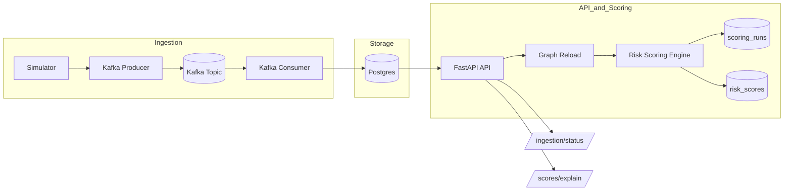

# Crypto AML Risk Platform

A production-style backend platform that simulates a crypto AML (Anti-Money Laundering) transaction monitoring system.

This project demonstrates how a real risk pipeline is built:

**streaming ingestion → idempotent persistence → graph analytics → scoring runs → explainability → observability**

All services are containerized and reproducible using Docker.

---

## 🚀 What this project demonstrates

* Streaming ingestion with Kafka
* Idempotent persistence in Postgres
* Graph-based multi-hop risk scoring
* Persistent scoring runs and audit trail
* Risk explainability with hop-level attribution
* Operational observability endpoints
* Automated database migrations (Alembic)
* Modern linting + CI (Ruff + pytest)
* Tests validated inside Docker containers

---

## 🧱 Architecture Diagram




All services run via Docker Compose.

---

## ✨ Key Features

### Streaming ingestion

* Simulator generates wallet-to-wallet transactions
* Kafka producer publishes events
* Consumer batches inserts into Postgres
* Idempotency via:

```
ON CONFLICT DO NOTHING
```

This guarantees safe retries and accurate ingestion metrics.

---

### Persistent storage

Database tables include:

* transactions (with ingested_at timestamp)
* ingestion_state
* scoring_runs
* risk_scores

Schema is managed by Alembic and automatically migrated on startup.

---

### Graph-based risk engine

* Builds a transaction graph from stored data
* Propagates multi-hop exposure risk
* Persists scoring runs and wallet scores
* Supports configurable hop weights

---

### Explainability (analyst workflow)

Endpoint:

```
GET /scores/explain/{wallet}
```

Returns:

* stored risk score
* hop-by-hop illicit exposure
* weighted risk contributions
* top contributing wallets
* scoring run metadata

This simulates how analysts investigate risky wallets.

---

### Observability

Endpoint:

```
GET /ingestion/status
```

Provides:

* ingestion progress
* throughput metrics
* seconds since last ingestion
* graph readiness
* node/edge counts
* latest scoring run

---

## 📌 API Endpoints

```
POST /reload-graph
POST /run-score
GET  /scores/top?limit=10
GET  /scores/{wallet}
GET  /scores/explain/{wallet}
GET  /ingestion/status
GET  /ready
GET  /health
```

---

## 📁 Repository Structure

```
crypto-risk-platform/
  services/
    api/
    ingestion/
    scoring/
  scripts/
    demo.py
  alembic/
  docker-compose.yml
  Dockerfile
  requirements.txt
  pyproject.toml
```

---

## ▶️ Quickstart (5 minutes)

Start the platform:

```
docker compose up -d --build
```

Generate transactions:

```
docker compose exec api python services/ingestion/simulator.py
```

Publish to Kafka:

```
docker compose exec api python services/ingestion/kafka_producer.py
```

Run the end-to-end demo:

```
python scripts/demo.py
```

The demo:

* reloads the graph
* runs scoring
* prints top wallets
* shows explainability for a wallet
* prints ingestion status

---

## 🧪 Developer Workflow

Lint:

```
docker compose exec api ruff check .
```

Run tests inside Docker:

```
docker compose exec api pytest -q
```

Hot reload is enabled for the API during development.

---

## 🔍 CI

GitHub Actions runs:

* Ruff lint
* pytest
* Docker build validation
* pytest inside Docker containers

This ensures environment parity with production.

---


## 🖼 Screenshots

Below are real outputs from running the demo workflow locally.

### Top wallets — risk leaderboard


This view shows the highest-risk wallets ranked by graph-based exposure score.

---

### Explainability — hop-by-hop attribution


The explainability endpoint breaks risk into hop layers and shows which neighboring wallets contribute to the score. This simulates how an AML analyst investigates suspicious entities.

---

### Ingestion status — operational telemetry


The ingestion status endpoint exposes throughput, processing metrics, graph readiness, and the latest scoring run — similar to real production observability dashboards.

## 🎯 Why this project exists

AML and fraud platforms must:

1. ingest high-volume transaction streams
2. store data reliably
3. compute graph-based risk signals
4. provide explainability for analysts
5. expose operational health metrics

This project is a portfolio-ready simulation of those systems.

---

## 📜 License

MIT
