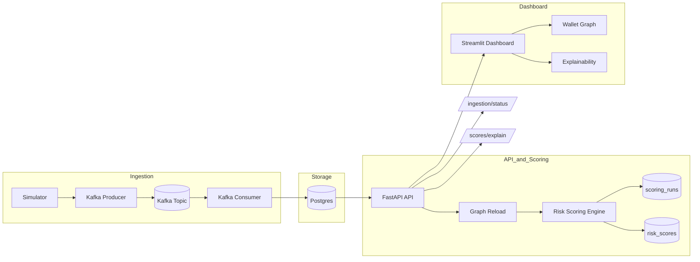

# Crypto AML Risk Platform

Production-style crypto AML risk pipeline with streaming ingestion, graph analytics, scoring, explainability, and a Streamlit analyst dashboard. The system is designed to mirror real-world AML monitoring flows end-to-end, from transaction ingestion to risk scoring and analyst review.

## What this project does

At a high level, the platform:

- Ingests wallet-to-wallet transactions via Kafka or CSV.
- Persists transactions and run metadata in Postgres.
- Builds a directed transaction graph for analysis.
- Runs multi-hop risk scoring with configurable weights.
- Exposes explainability and observability endpoints.
- Provides a Streamlit dashboard for analysts to explore results.

## Architecture



## Highlights

- Kafka ingestion with idempotent writes to Postgres.
- Multi-hop graph risk scoring with persisted runs and audit trail.
- Explainability endpoint for hop-by-hop attribution.
- Streamlit dashboard with wallet graph exploration, presets, and export.
- Docker-first setup with Alembic migrations.

## Repository structure

```
crypto-risk-platform/
  services/
    api/
    ingestion/
    scoring/
  scripts/
    demo.py
  alembic/
  docker-compose.yml
  Dockerfile
  requirements.txt
  pyproject.toml
```

## Quickstart

Start the platform:

```
docker compose up -d --build
```

Access services:

- API: http://localhost:8000
- Dashboard: http://localhost:8501
- Postgres: localhost:5432

Generate sample transactions and publish to Kafka:

```
docker compose exec api python services/ingestion/simulator.py
docker compose exec api python -m services.ingestion.kafka_producer
```

Run the demo script:

```
python scripts/demo.py
```

## Dashboard

The Streamlit UI focuses on analyst workflows:

- Risk leaderboard and explainability views.
- Wallet graph visualization with filters, presets, and export.
- Connected-only filtering to hide isolated nodes before graph load.

## API

Core endpoints:

```
GET  /health
POST /reload-graph
POST /run-score
GET  /scores/top?limit=10
GET  /scores/{wallet}
GET  /scores/explain/{wallet}
GET  /ingestion/status
GET  /ready
GET  /graph/wallet/{wallet}
```

Wallet graph query parameters:

- `hops` (1-4, default 2)
- `edge_limit` (50-3000, default 600)
- `node_limit` (10-500, default 100)
- `min_amount` (0.0+, default 0.0)
- `only_connected` (bool, default false)

## Configuration

Key environment variables (see docker-compose.yml):

| Variable | Default | Purpose |
| --- | --- | --- |
| `TX_SOURCE` | `csv` | Data source (`csv` or `db`). |
| `DATABASE_URL` | `postgresql+psycopg2://risk:risk@db:5432/riskdb` | Database connection. |
| `KAFKA_BOOTSTRAP_SERVERS` | `kafka:29092` | Kafka broker. |
| `KAFKA_TOPIC_TRANSACTIONS` | `transactions` | Kafka topic name. |
| `ILLICIT_SEED` | `123` | Seed for illicit wallet selection. |
| `API_BASE_URL` | `http://api:8000` | Dashboard API base URL. |

## Development

Run lint and tests locally:

```
ruff check .
pytest -q
```

Or run inside Docker:

```
docker compose exec api ruff check .
docker compose exec api pytest -q
```

## Docs and screenshots

- Architecture deep dive: docs/PROJECT_WALKTHROUGH.md
- Screenshots: assets/screenshots/

## Scoring and graph generation

This section explains how the transaction graph is built and how risk scores are computed.

### Transaction graph

The platform builds a directed graph where:

- Nodes are wallet addresses.
- Directed edges represent transfers from sender to receiver.
- Edge attributes include transaction counts and total transferred amount.

The graph is built from either:

- CSV transactions (default), or
- Postgres transactions (when `TX_SOURCE=db`).

During graph reload, all transactions are read into memory and converted into a NetworkX graph. The graph is used for neighborhood exploration and scoring.

### Scoring inputs and configuration

Risk scoring is based on multi-hop exposure to illicit seed wallets. The configuration is defined in `RiskConfig` and includes:

- `hop_weights`: weights applied to exposure at each hop (default `[1.0, 0.6, 0.3]`).
- `degree_normalize`: optional normalization by wallet degree.
- `illicit_seed_pct`: percentage of wallets marked as illicit seeds for demo purposes.

Illicit seed wallets are selected deterministically using `ILLICIT_SEED` to keep demo runs reproducible.

### Multi-hop exposure propagation

For each wallet, the risk engine:

1. Finds neighbors up to the configured hop depth.
2. Computes exposure at each hop as the fraction of illicit neighbors.
3. Applies hop weights to get a weighted exposure score.
4. Optionally normalizes by degree to reduce bias toward high-degree hubs.

The final risk score is the weighted sum of hop exposures, with metadata such as in-degree and out-degree preserved for explainability.

### Example: how a wallet is scored

Assume a wallet `0xabc...` has the following exposure to illicit wallets across hops:

- Hop 0 exposure: 0.10
- Hop 1 exposure: 0.40
- Hop 2 exposure: 0.20

With the default hop weights `[1.0, 0.6, 0.3]`, the weighted score is:

$$
score = (0.10 \times 1.0) + (0.40 \times 0.6) + (0.20 \times 0.3) = 0.10 + 0.24 + 0.06 = 0.40
$$

If `degree_normalize` is enabled, the score is adjusted by the wallet's degree to reduce bias toward hubs. The explainability endpoint shows the raw exposures, weights, and the final score used in ranking.

### Persisted scoring runs

Scoring is stored in Postgres for auditability:

- `scoring_runs` records configuration and timestamp.
- `risk_scores` stores per-wallet scores, exposures, and degree metrics.

This enables stable explainability queries even as new data is ingested.

### Explainability

Explainability is built on persisted scores and graph structure. The `/scores/explain/{wallet}` endpoint returns:

- The stored risk score.
- Hop-by-hop exposure breakdown.
- Weighted contribution per hop.
- Top contributing wallets and their relative impact.

This mirrors the workflow of an AML analyst investigating why a wallet scored high.

### Wallet graph endpoint

The `/graph/wallet/{wallet}` endpoint generates a subgraph around a target wallet using:

- k-hop neighborhood discovery for candidate nodes.
- Node prioritization based on risk score, degree, illicit status, and proximity.
- Edge aggregation to show counts and total amounts.

The dashboard uses this endpoint to render the interactive wallet graph and filter results.

## Live Ethereum data

The system can ingest real Ethereum transactions and run the same scoring flow.

Workflow:

1. Fetch real data to CSV:

```
python services/blockchain/fetch_ethereum.py --wallets <addresses> --output data/ethereum_transactions.csv
```

2. Publish to Kafka:

```
docker compose exec api python -m services.ingestion.kafka_producer
```

3. Reload graph and score from the dashboard or API.

You can also switch `TX_SOURCE` to `db` and ingest into Postgres for persistence. The same scoring and explainability pipeline applies to live blockchain data.

## License

MIT
