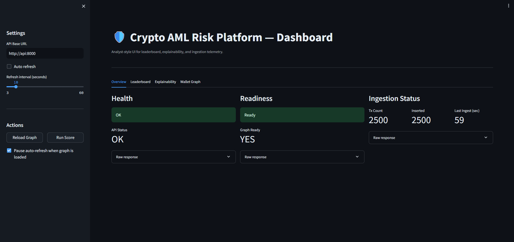
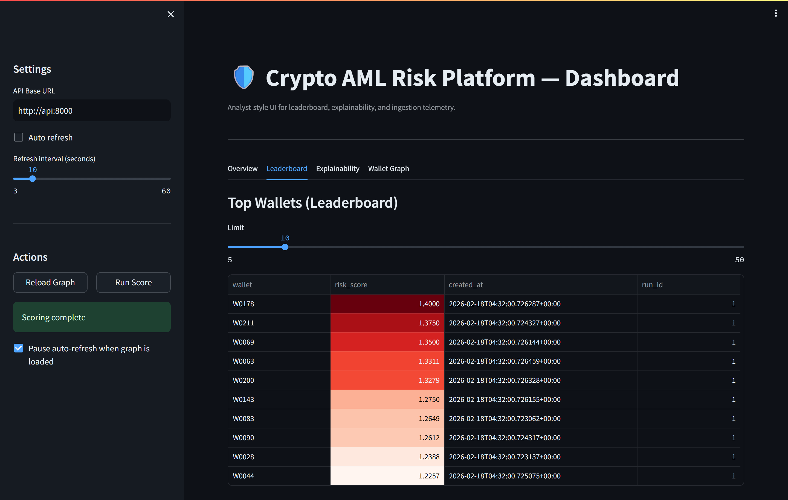
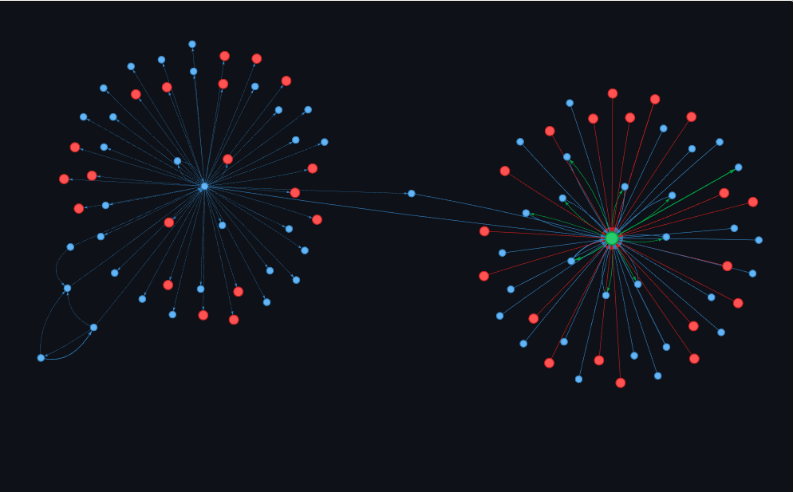
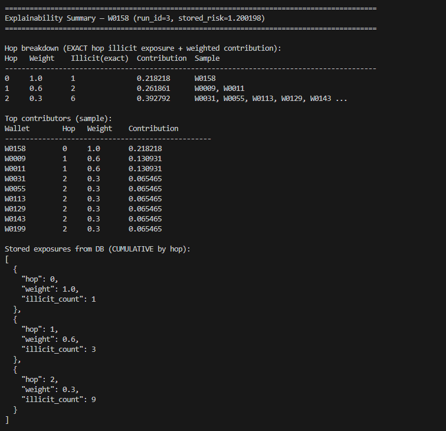
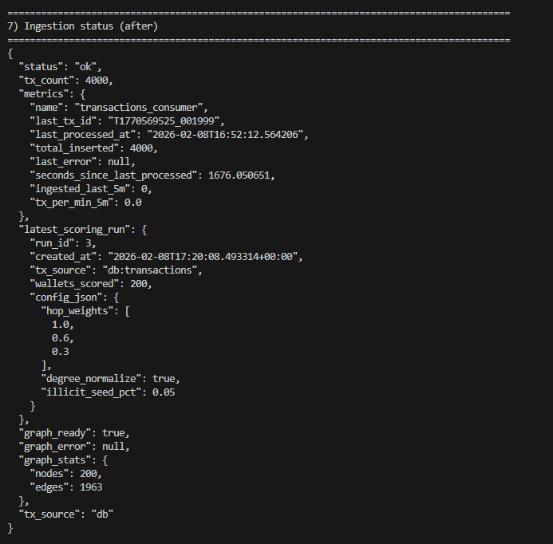
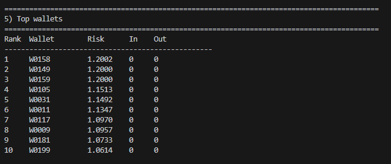

# Crypto AML Risk Platform 🛡️

Production-grade crypto AML risk detection system with streaming ingestion, graph analytics, multi-hop risk scoring, explainability, and interactive visualization. Built for analysts to detect and investigate suspicious cryptocurrency transactions.

---

## 🎯 What This Platform Does

Real-world AML monitoring pipeline from end-to-end:

- **Ingests** wallet-to-wallet transactions (live Ethereum data via Etherscan or streaming via Kafka)
- **Stores** transactions and metadata in PostgreSQL
- **Builds** directed transaction graph for network analysis
- **Scores** wallets using multi-hop risk algorithm with configurable weights
- **Explains** why wallets are risky (hop-by-hop breakdown)
- **Visualizes** transaction networks with interactive graph explorer

---

## 🏗️ Architecture

```mermaid
flowchart LR
  subgraph Ingestion
    ETH[Etherscan API]
    PROD[Kafka Producer]
    K[(Kafka Topic)]
    CONS[Kafka Consumer]
  end

  subgraph Storage
    DB[(PostgreSQL)]
  end

  subgraph API
    API[FastAPI]
    GRAPH[Graph Engine]
    SCORE[Risk Scoring]
  end

  subgraph Dashboard
    DASH[Streamlit UI]
    VIZ[Graph Visualizer]
  end

  ETH --> API
  PROD --> K --> CONS --> DB
  DB --> API
  API --> GRAPH --> SCORE
  API --> DASH --> VIZ
```

### Components

- **Etherscan Fetcher** - Pulls live Ethereum transactions
- **Kafka Pipeline** - Streaming ingestion (producer → consumer)
- **PostgreSQL** - Persistent storage for transactions and scores
- **Risk Engine** - Multi-hop graph algorithm with degree normalization
- **FastAPI** - REST API for scoring, explainability, and graph queries
- **Streamlit Dashboard** - Analyst UI with leaderboard, explainability, and network graph

---

## 🚀 Quick Start

### Prerequisites

- Docker & Docker Compose
- (Optional) Etherscan API key for live data

### Run Complete Demo

```bash
# Make demo script executable
chmod +x run_demo.sh

# Run full demo (includes data ingestion)
./run_demo.sh
```

**The demo will:**
1. Fetch live Ethereum transactions (or generate sample data)
2. Start all services (PostgreSQL, API, Dashboard)
3. Build transaction graph
4. Run risk scoring
5. Show top risky wallets with explainability
6. Display network visualization

**Duration:** ~3 minutes

---

## 📊 Access Services

### In GitHub Codespaces

The script automatically detects Codespaces and uses forwarded ports:
- **Dashboard**: Click "Ports" tab → Open port 8501
- **API Docs**: Click "Ports" tab → Open port 8000

### Local Development

- **Dashboard**: http://localhost:8501
- **API**: http://localhost:8000
- **API Docs (Swagger)**: http://localhost:8000/docs
- **PostgreSQL**: localhost:5432

---

## 🎬 Demo Walkthrough

### 1. Health Check
```bash
curl http://localhost:8000/health | jq
```

### 2. Load Graph from Data
```bash
curl -X POST http://localhost:8000/reload-graph | jq
```

### 3. Run Risk Scoring
```bash
curl -X POST http://localhost:8000/run-score | jq
```

### 4. View Top Risk Wallets
```bash
curl 'http://localhost:8000/scores/top?limit=10' | jq
```

### 5. Explain a Wallet's Risk
```bash
# Get top wallet
WALLET=$(curl -s 'http://localhost:8000/scores/top?limit=1' | jq -r '.[0].wallet')

# Get explainability
curl "http://localhost:8000/scores/explain/$WALLET?max_hops=2" | jq
```

### 6. Get Transaction Network
```bash
curl "http://localhost:8000/graph/wallet/$WALLET?hops=2&node_limit=50" | jq
```

---

## 📚 How It Works

### Multi-Hop Risk Scoring Algorithm

The platform calculates wallet risk scores based on proximity to known illicit wallets:

**Formula:**
```
risk_score = Σ(hop_weight[h] × illicit_count[h]) / sqrt(degree)
```

Where:
- `hop_weight` = (1.0, 0.6, 0.3) for hops 0, 1, 2
- `illicit_count[h]` = number of illicit wallets at exact hop distance h
- `degree` = in_degree + out_degree (for normalization)

**Key Features:**
- **Multi-hop exposure**: Considers 0-hop (direct), 1-hop (neighbors), 2-hop (neighbors-of-neighbors)
- **Weighted decay**: Closer relationships have higher impact
- **Degree normalization**: Prevents bias toward high-connectivity wallets (exchanges, contracts)

### Explainability

For any wallet, the platform provides:

1. **Hop Breakdown**: Exact count of illicit wallets at each hop distance
2. **Top Contributors**: Specific illicit wallets contributing to the score
3. **Contribution Values**: How much each illicit wallet increases the risk
4. **Network Context**: In/out degree, tag (center/illicit/neighbor)

---

## 🎨 Dashboard Features

### Overview Tab
- Health status and readiness checks
- Ingestion metrics (transaction count, graph stats)
- Recent scoring run summary

### Leaderboard Tab
- Top N highest risk wallets (sortable table)
- Risk score distribution chart
- Wallet details (in/out degree, timestamps)

### Explainability Tab
- Wallet selector dropdown
- Hop-by-hop breakdown table
- Top contributing wallets list
- Contribution chart visualization

### Wallet Graph Tab
- Interactive network visualization (PyVis)
- Visual filters:
  - Direction (incoming/outgoing/both)
  - Hop distance limiter
  - Node type tags (center/illicit/neighbor)
  - Transaction count and amount thresholds (supports 4 decimal places)
  - Top-K edges by amount
- Color-coded nodes:
  - 🟢 Green = Center (selected wallet)
  - 🔴 Red = Illicit (flagged)
  - 🔵 Blue = Neighbor (normal)

---

## 📸 Screenshots

### Dashboard Overview

Health status, readiness checks, and real-time Kafka ingestion metrics showing transaction processing.

### Leaderboard - Top Risk Wallets

Sortable table displaying highest risk wallets with scores, degrees, and timestamps. Includes risk distribution visualization.

### Wallet Graph Visualization

Interactive transaction network with customizable filters (hops, node types, amounts, edge limits). Supports graph presets and export.

### Explainability Analysis

Hop-by-hop risk breakdown showing exactly which illicit wallets contribute to a wallet's score.

### Ingestion Telemetry (Legacy)

Real-time ingestion metrics and graph statistics during data processing.

### Top Wallets Table (Legacy)

Basic view of highest risk wallets with scoring metrics.

---

## 🚨 Known Limitations

- **Illicit labels**: Currently simulated (5% random sample). Replace with real labeled data.
- **Scalability**: In-memory graph limits to ~100K wallets. For larger graphs, use GraphDB (Neo4j).
- **Rate limits**: Etherscan free tier is rate-limited (5 calls/sec).
- **Real-time**: Current design is batch-oriented. For real-time, optimize scoring for incremental updates.

---

## 🤝 Contributing

### Adding Features

1. **New risk algorithm**: Edit `services/scoring/risk_engine.py`
2. **New API endpoint**: Add to `services/api/main.py`
3. **Dashboard tab**: Extend `dashboard/app.py`
4. **Data source**: Implement in `services/blockchain/` or `services/ingestion/`

### Code Style

- Python: Follow PEP 8, use type hints
- Format: `black` and `ruff`
- Test: Write pytest tests in `tests/`

---

## 📚 Additional Documentation

- **Project Walkthrough**: [docs/PROJECT_WALKTHROUGH.md](docs/PROJECT_WALKTHROUGH.md)
- **Blockchain Guide**: [docs/BLOCKCHAIN_GUIDE.md](docs/BLOCKCHAIN_GUIDE.md)
- **Screenshots**: [assets/screenshots/](assets/screenshots/)

---

## 📄 License

MIT License - See [LICENSE](LICENSE) file

---

## 🙏 Acknowledgments

- Inspired by real-world AML compliance requirements
- Built with: FastAPI, Streamlit, NetworkX, PostgreSQL, Kafka
- Ethereum data via Etherscan API

---

## 🎯 Next Steps

After running the demo:

1. **Explore Dashboard** - Interact with all 4 tabs
2. **Try API** - Use Swagger docs at /docs
3. **Fetch Real Data** - Add your Etherscan API key
4. **Customize Scoring** - Adjust hop weights
5. **Add Labels** - Replace simulated illicit set with real data

**Happy analyzing! 🚀**
### Live Ethereum Data (Recommended)

The demo script (`./run_demo.sh`) automatically fetches live data using your Etherscan API key.

**Manual fetch:**
```bash
# Set API key in .env
ETHERSCAN_API_KEY=your_key_here

# Fetch data for specific wallets
docker compose exec api python -m services.blockchain.fetch_ethereum \
    --wallets 0xd8da6bf26964af9d7eed9e03e53415d37aa96045 \
    --api-key $ETHERSCAN_API_KEY \
    --output data/transactions.csv
```

**Well-known wallets included in demo:**
- Vitalik Buterin's wallet
- Binance exchange wallets
- WETH contract
- Major DeFi protocol wallets

### Sample Generated Data

```bash
docker compose exec api python -c "
from services.ingestion.simulator import simulate_transactions, write_transactions_csv
df = simulate_transactions(n_wallets=200, n_txs=2000)
write_transactions_csv(df)
"
```

### Kafka Streaming Ingestion

```bash
# Start Kafka services
docker compose up -d kafka zookeeper

# Publish transactions from CSV
docker compose exec api python -m services.ingestion.kafka_producer

# Consumer will automatically ingest into DB
docker compose logs -f consumer
```

---

## 🎓 Technical Details

### Graph Construction
- **Type**: Directed graph (DiGraph)
- **Nodes**: Unique wallet addresses
- **Edges**: Aggregated transactions (tx_count + total_amount)
- **Storage**: In-memory NetworkX graph + PostgreSQL persistence

### Risk Engine
- **Algorithm**: Multi-hop BFS with weighted aggregation
- **Complexity**: O(V + E) for graph construction, O(V × hops) for scoring
- **Normalization**: sqrt(in_degree + out_degree)
- **Illicit seed**: Randomly selected 5% of wallets (configurable)

### Database Schema

**Tables:**
- `transactions` - Raw transaction data
- `scoring_runs` - Metadata for each scoring execution
- `risk_scores` - Per-wallet scores and exposures
- `ingestion_state` - Kafka consumer state

## Configuration

Key environment variables (see docker-compose.yml):

| Variable | Default | Purpose |
| --- | --- | --- |
| `TX_SOURCE` | `csv` | Data source (`csv` or `db`). |
| `DATABASE_URL` | `postgresql+psycopg2://risk:risk@db:5432/riskdb` | Database connection. |
| `KAFKA_BOOTSTRAP_SERVERS` | `kafka:29092` | Kafka broker. |
| `KAFKA_TOPIC_TRANSACTIONS` | `transactions` | Kafka topic name. |
| `ILLICIT_SEED` | `123` | Seed for illicit wallet selection. |
| `API_BASE_URL` | `http://api:8000` | Dashboard API base URL. |

## Development

Run lint and tests locally:

```
ruff check .
pytest -q
```

Or run inside Docker:

```
docker compose exec api ruff check .
docker compose exec api pytest -q
```

## Docs and screenshots

- Architecture deep dive: docs/PROJECT_WALKTHROUGH.md
- Screenshots: assets/screenshots/

## Scoring and graph generation

This section explains how the transaction graph is built and how risk scores are computed.

### Transaction graph

The platform builds a directed graph where:

- Nodes are wallet addresses.
- Directed edges represent transfers from sender to receiver.
- Edge attributes include transaction counts and total transferred amount.

The graph is built from either:

- CSV transactions (default), or
- Postgres transactions (when `TX_SOURCE=db`).

During graph reload, all transactions are read into memory and converted into a NetworkX graph. The graph is used for neighborhood exploration and scoring.

### Scoring inputs and configuration

Risk scoring is based on multi-hop exposure to illicit seed wallets. The configuration is defined in `RiskConfig` and includes:

- `hop_weights`: weights applied to exposure at each hop (default `[1.0, 0.6, 0.3]`).
- `degree_normalize`: optional normalization by wallet degree.
- `illicit_seed_pct`: percentage of wallets marked as illicit seeds for demo purposes.

Illicit seed wallets are selected deterministically using `ILLICIT_SEED` to keep demo runs reproducible.

### Multi-hop exposure propagation

For each wallet, the risk engine:

1. Finds neighbors up to the configured hop depth.
2. Computes exposure at each hop as the fraction of illicit neighbors.
3. Applies hop weights to get a weighted exposure score.
4. Optionally normalizes by degree to reduce bias toward high-degree hubs.

The final risk score is the weighted sum of hop exposures, with metadata such as in-degree and out-degree preserved for explainability.

### Example: how a wallet is scored

Assume a wallet `0xabc...` has the following exposure to illicit wallets across hops:

- Hop 0 exposure: 0.10
- Hop 1 exposure: 0.40
- Hop 2 exposure: 0.20

With the default hop weights `[1.0, 0.6, 0.3]`, the weighted score is:

$$
score = (0.10 \times 1.0) + (0.40 \times 0.6) + (0.20 \times 0.3) = 0.10 + 0.24 + 0.06 = 0.40
$$

If `degree_normalize` is enabled, the score is adjusted by the wallet's degree to reduce bias toward hubs. The explainability endpoint shows the raw exposures, weights, and the final score used in ranking.

### Persisted scoring runs

Scoring is stored in Postgres for auditability:

- `scoring_runs` records configuration and timestamp.
- `risk_scores` stores per-wallet scores, exposures, and degree metrics.

This enables stable explainability queries even as new data is ingested.

### Explainability

Explainability is built on persisted scores and graph structure. The `/scores/explain/{wallet}` endpoint returns:

- The stored risk score.
- Hop-by-hop exposure breakdown.
- Weighted contribution per hop.
- Top contributing wallets and their relative impact.

This mirrors the workflow of an AML analyst investigating why a wallet scored high.

### Wallet graph endpoint

The `/graph/wallet/{wallet}` endpoint generates a subgraph around a target wallet using:

- k-hop neighborhood discovery for candidate nodes.
- Node prioritization based on risk score, degree, illicit status, and proximity.
- Edge aggregation to show counts and total amounts.

The dashboard uses this endpoint to render the interactive wallet graph and filter results.

## Live Ethereum data

The system can ingest real Ethereum transactions and run the same scoring flow.

Workflow:

1. Fetch real data to CSV:

```
python services/blockchain/fetch_ethereum.py --wallets <addresses> --output data/ethereum_transactions.csv
```

2. Publish to Kafka:

```
docker compose exec api python -m services.ingestion.kafka_producer
```

3. Reload graph and score from the dashboard or API.

You can also switch `TX_SOURCE` to `db` and ingest into Postgres for persistence. The same scoring and explainability pipeline applies to live blockchain data.

## License

MIT
