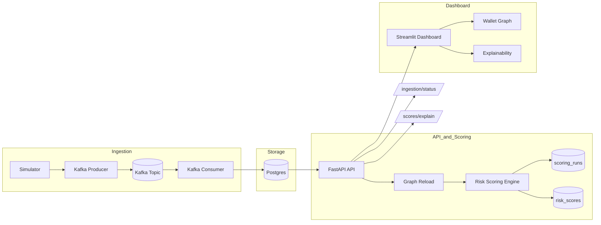

# Crypto AML Risk Platform

Production-style crypto AML risk pipeline with streaming ingestion, graph analytics, scoring, explainability, and a Streamlit analyst dashboard. Everything runs in Docker for reproducible demos and local development.

## Architecture



## Highlights

- Kafka ingestion with idempotent writes to Postgres.
- Multi-hop graph risk scoring with persisted runs and audit trail.
- Explainability endpoint for hop-by-hop attribution.
- Streamlit dashboard with wallet graph exploration, presets, and export.
- Docker-first setup with Alembic migrations.

## Repository structure

```
crypto-risk-platform/
  services/
    api/
    ingestion/
    scoring/
  scripts/
    demo.py
  alembic/
  docker-compose.yml
  Dockerfile
  requirements.txt
  pyproject.toml
```

## Quickstart

Start the platform:

```
docker compose up -d --build
```

Access services:

- API: http://localhost:8000
- Dashboard: http://localhost:8501
- Postgres: localhost:5432

Generate sample transactions and publish to Kafka:

```
docker compose exec api python services/ingestion/simulator.py
docker compose exec api python -m services.ingestion.kafka_producer
```

Run the demo script:

```
python scripts/demo.py
```

## Dashboard

The Streamlit UI focuses on analyst workflows:

- Risk leaderboard and explainability views.
- Wallet graph visualization with filters, presets, and export.
- Connected-only filtering to hide isolated nodes before graph load.

## API

Core endpoints:

```
GET  /health
POST /reload-graph
POST /run-score
GET  /scores/top?limit=10
GET  /scores/{wallet}
GET  /scores/explain/{wallet}
GET  /ingestion/status
GET  /ready
GET  /graph/wallet/{wallet}
```

Wallet graph query parameters:

- `hops` (1-4, default 2)
- `edge_limit` (50-3000, default 600)
- `node_limit` (10-500, default 100)
- `min_amount` (0.0+, default 0.0)
- `only_connected` (bool, default false)

## Configuration

Key environment variables (see docker-compose.yml):

| Variable | Default | Purpose |
| --- | --- | --- |
| `TX_SOURCE` | `csv` | Data source (`csv` or `db`). |
| `DATABASE_URL` | `postgresql+psycopg2://risk:risk@db:5432/riskdb` | Database connection. |
| `KAFKA_BOOTSTRAP_SERVERS` | `kafka:29092` | Kafka broker. |
| `KAFKA_TOPIC_TRANSACTIONS` | `transactions` | Kafka topic name. |
| `ILLICIT_SEED` | `123` | Seed for illicit wallet selection. |
| `API_BASE_URL` | `http://api:8000` | Dashboard API base URL. |

## Development

Run lint and tests locally:

```
ruff check .
pytest -q
```

Or run inside Docker:

```
docker compose exec api ruff check .
docker compose exec api pytest -q
```

## Docs and screenshots

- Architecture deep dive: docs/PROJECT_WALKTHROUGH.md
- Screenshots: assets/screenshots/

## License

MIT
